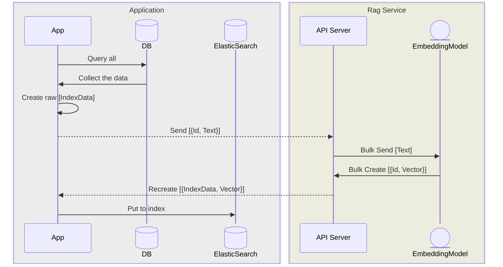
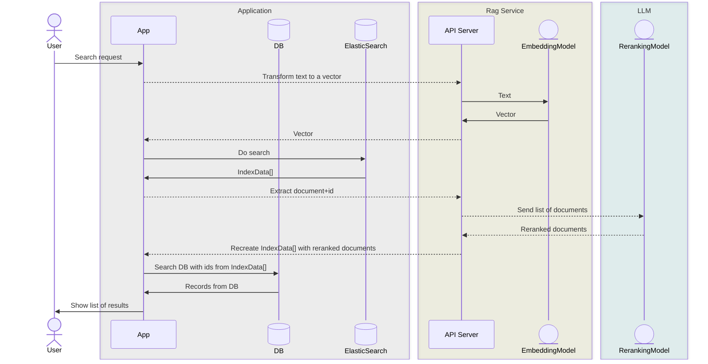

# Brainless

## Requirements

You need to set up the embedding server from here: https://github.com/RESTAR-inc/brainless_embedding_service

After that set env variables:

- RAG_SERVICE_URL
- RAG_SERVICE_API_KEY (use the same key as in `brainless_embedding_service`)

## Howto

Create `.env` file (see `.env.example`)

1. Instal dependencies `$ mix deps.get`
2. Run docker containers `$ docker compose up -d`
3. Run migration `$ mix ecto.migrate`
4. Seed the database `$ mix media_library.seed`
5. Build index `$ mix build_index`
6. Start the application `$ mix phx.server`

Now you can start the server. Check `/media` route

(Optional)

If you want to use `gemini` to build the index, you need to obtain a [Gemini API Key](https://aistudio.google.com/api-keys). Put it into `GOOGLE_API_KEY` in your environment.

You can switch to Gemini by changing the config:

```elixir
config :brainless, Brainless.Rag, embedding_provider: :gemini,
```

## How it works

### Indexing Flow



### Search Flow


